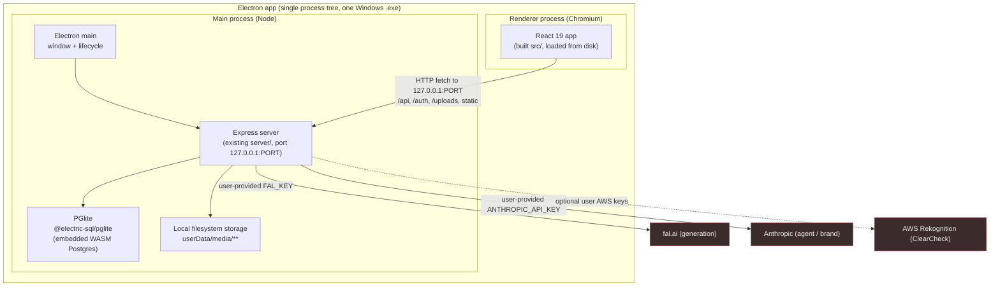
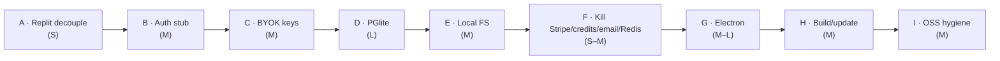

# CONVERSION.md — Teseract 3.0 / Matteblack → Local, Login-less, Open-Source Windows Desktop App

> Engineering roadmap for converting the cloud SaaS ("Teseract 3.0 / Matteblack", an AI creative
> suite) into a single-user, login-less, open-source **Electron desktop app** that runs entirely
> on the user's Windows machine, with **user-provided AI keys** and **no cloud dependencies**.

**Audience:** the developer(s) executing the migration.
**Status of this document:** living plan. Section 8 tracks what is already done vs. remaining.

---

## 1. Executive summary

The product today is a two-process web app: a Vite + React 19 + TypeScript frontend (`src/`) and an
Express 5 backend (`server/`) backed by PostgreSQL, Cloudflare R2 object storage, WorkOS auth,
Stripe billing, Redis presence/caching, Resend email, and three third-party AI providers (fal.ai for
generation, Anthropic for the agent/brand features, AWS Rekognition for copyright checking). It was
hosted on Replit.

The good news: the architecture is already close to what a local app needs.

- **Generation is entirely server-side.** The client `POST`s `/api/generate`
  (`server/index.ts:2113`), the server dispatches to fal.ai (`server/fal.ts:1576` `dispatchToFal`)
  as an async job, and the client polls `/api/job/:id` (`server/index.ts:2551`). The client-side
  `src/api/fal.ts` (`VITE_FAL_KEY`) is **dead code**. So "bring your own key" only has to touch the
  server.
- **There is no hard login wall.** `App.tsx:160` computes `const isGuest = !authUser` and runs in a
  degraded guest mode. A `DEV_AUTH_BYPASS` seam (`server/sessions.ts:11`) already injects a
  superadmin dev user via a signed JWT cookie — this is 90% of the local-auth stub.
- **Superadmin already bypasses all credit checks** (`server/credits/creditGate.ts:248-252`), so
  "unlimited local generation" is a one-branch change, not a system rip-out.
- **Storage is behind a clean interface** (`server/storage.ts`): `saveFile` / `getFileUrl` /
  `deleteFile` / `copyFile` / `getFileStream` / `rehostExternalUrlToR2` / `parseFileUrl` /
  `isR2HostedUrl`. Swapping R2 for the local filesystem is an interface reimplementation.
- **Redis is already optional** with a documented Postgres fallback
  (`server/services/redisClient.ts:28-30`).

The hard parts are: (1) the **PostgreSQL → embedded DB** move — the schema is ~1,269 lines of
Postgres-specific DDL (`server/db.ts`) using `plpgsql` trigger functions, `DO $$` blocks, `TEXT[]`
arrays, `JSONB`, `gen_random_uuid()`, and partial indexes; (2) **Electron packaging** of a Node
Express server plus native/heavy deps (FFmpeg, puppeteer); and (3) stripping the cloud billing/auth
paths cleanly without breaking the ~90 route handlers gated by `requireAuth` / `requireVerifiedEmail`.

**Recommended DB replacement:** **PGlite** (`@electric-sql/pglite`) — embedded WASM Postgres. It
keeps the SQL dialect **identical**, so the 1,269-line schema, the `plpgsql` triggers, and every
parameterized query survive with near-zero rewrites. SQLite would force a full dialect rewrite (see
§4-D and §5).

**Recommended packaging:** **Electron**. It bundles Node, so the existing Express server + PGlite
run unchanged in a utility/main process. Tauri is lighter but its Rust core cannot host a Node
Express server without shipping Node as a sidecar, which erases the weight advantage and adds
IPC/process-management complexity (see §4-G).

---

## 2. Target architecture

**Key properties of the target:**

- One installable Windows executable. On launch, Electron main boots the Express server bound to
  `127.0.0.1` on an ephemeral port, waits for readiness, then loads the built React bundle into the
  `BrowserWindow`.
- All persistent state lives under Electron's `app.getPath('userData')`:
  - `userData/db/` — PGlite data directory.
  - `userData/media/` — the former R2 buckets, now folders.
  - `userData/config.json` — user-provided API keys and settings.
- No auth server, no billing, no email, no Redis required. Presence/canvas caching degrade to the
  existing in-memory / direct-Postgres fallbacks.
- The renderer keeps talking to the server over HTTP (loopback), so the entire `src/` fetch layer
  and the ~90 gated routes work **unchanged** once the auth middleware resolves a fixed local user.

**Why keep the HTTP server rather than collapse into Electron IPC?** The frontend has a large,
mature `/api` surface and server-side generation orchestration (job queue, polling, R2 rehosting,
SSE for canvas). Rewriting that to IPC is a multi-week rewrite with no user-facing benefit. Binding
Express to loopback is the low-risk path and preserves the option of a "headless server" distribution
later.

---

## 3. Cloud dependency → local replacement matrix

Effort: **S** = < ½ day, **M** = 1–3 days, **L** = 3+ days. Risk reflects likelihood of subtle
breakage.

| # | Cloud dependency | Where | Local replacement | Effort | Risk |
|---|---|---|---|---|---|
| 1 | **WorkOS AuthKit** (login, sessions, redirects) | `server/sessions.ts`, `server/index.ts:202-471` | Local-mode auth stub: reuse `DEV_AUTH_BYPASS` seam, auto-provision one fixed local superadmin user, no redirects | **M** | Med |
| 2 | **PostgreSQL** (`pg` Pool) | `server/db.ts` (1,269 lines), every route | **PGlite** (`@electric-sql/pglite`) — same dialect | **L** | High |
| 3 | **Cloudflare R2** via `@aws-sdk/client-s3` | `server/storage.ts` (316 lines) | Local FS under `userData/media`, served by Express static route | **M** | Med |
| 4 | **Stripe** (billing) | `server/stripe.ts`, `server/routes/payments.ts` (1,313 lines), webhook `server/index.ts:58` | Disable: mount no-op/410 routes; frontend hides billing UI | **M** | Low |
| 5 | **Credits system** (ledger, pricing, rate limits) | `server/credits/creditGate.ts` (907 lines), `credit_ledger`, `model_pricing`, `rate_limits` tables | Force superadmin path → unlimited (`creditGate.ts:248-252`) | **S** | Low |
| 6 | **Redis** (`ioredis`, presence + canvas cache) | `server/services/redisClient.ts`, `server/routes/presence.ts`, canvas cache | Already optional; ship with `REDIS_URL` unset → in-memory / direct-PG fallback | **S** | Low |
| 7 | **Resend** (email) | `server/email.ts` (103 lines), invitations, email-change | No-op the send functions; drop invitation/verification email flows | **S** | Low |
| 8 | **fal.ai** (`FAL_KEY`) — core generation | `server/fal.ts:291-296`, `1591` | User-provided key from `config.json` / settings UI; re-`fal.config()` on change | **M** | Med |
| 9 | **Anthropic** (`ANTHROPIC_API_KEY`) — agent, brand IQ | `server/routes/agent.ts:20,125`, `server/routes/brandIq.ts:44,46` | User-provided key; feature already 503s gracefully when unset | **S** | Low |
| 10 | **AWS Rekognition** — ClearCheck copyright | `server/clearcheck.ts:92-100,184-190` | Optional user-provided AWS keys; feature already errors gracefully when unset | **S** | Low |
| 11 | **Replit host** (`.replit`, `replit.nix`, `replit.md`, `REPLIT_*` env) | root + `server/index.ts:219` | Remove host files; replace `REPLIT_DOMAINS`/`REPLIT_DEV_DOMAIN` usage | **S** | Low |
| 12 | **Client-side fal** (`VITE_FAL_KEY`) | `src/api/fal.ts`, `.env.example` | Delete — confirmed dead code (generation is server-side) | **S** | Low |

---

## 4. Phase-by-phase migration plan

Phases are ordered to keep the app runnable at every step. Each merges independently. A/B/C get you
to "runs locally against a local Postgres with your own keys"; D/E remove the last cloud infra;
F cleans up; G/H package; I open-sources.

Recommended cross-cutting flag: introduce a single `LOCAL_MODE` boolean
(`process.env.LOCAL_MODE === "true"`, defaulting on inside the Electron build) and branch on it
rather than deleting cloud code wholesale. This keeps the web SaaS buildable from the same tree and
makes each phase a reviewable diff. `DEV_AUTH_BYPASS` is the existing precedent for this pattern.

---

### Phase A — Replit decoupling & secrets hygiene

**Goal:** the repo builds and runs with zero Replit assumptions; secrets come from a local
`.env` / `config.json`, not Replit Secrets.

**Files touched:**
- Remove `/.replit`, `/replit.nix`, `/replit.md` (host-specific).
- `server/index.ts:219` — the `/auth/login` redirect URI derives from
  `REPLIT_DEV_DOMAIN` / `REPLIT_DOMAINS`. Remove or gate behind `LOCAL_MODE` (auth is stubbed in
  Phase B anyway).
- `server/storage.ts:7-11` — this **throws at import time** if the five `R2_*` vars are missing
  ("Set these in Replit Secrets"). This is the single biggest blocker to running locally today.
  Replace with the local-FS backend in Phase E; for now, gate the throw behind `!LOCAL_MODE`.
- Introduce `LOCAL_MODE` and a small `server/config/localConfig.ts` that reads
  `userData/config.json` (keys, paths) with `.env` fallback.
- Update root `README.md` (currently describes the fal.ai web app) later in Phase I.

**Risks:** hidden `REPLIT_*` references. Grep before declaring done:
`grep -ri "replit\|REPLIT_" server/ src/`.

**Verify:** `npm run dev:server` starts without any `REPLIT_*` or Replit Secrets present (it will
still fail on `DATABASE_URL`/`R2_*` until B–E — that's expected; the point is no Replit-specific
failures).

---

### Phase B — Local-mode auth stub (login-less)

**Goal:** the app boots straight into an authenticated single-user session with no login screen,
no WorkOS, no redirects.

**Current state to exploit:**
- `server/sessions.ts:11` `DEV_AUTH_BYPASS` already: skips WorkOS entirely
  (`getLocalUserFromSession` L338-350 verifies a local JWT cookie), and `/auth/dev-login`
  (`server/index.ts:129`) provisions a superadmin user + workspace + membership + credits row in one
  transaction.
- `requireAuth` (`server/sessions.ts:437`) and `requireVerifiedEmail` (`:452`) are the only two
  gates on the ~90 protected routes. In `DEV_AUTH_BYPASS`, `requireVerifiedEmail` still hits the DB
  for `email_verified`, but the dev user is created with `email_verified = true`.

**Design:** add `LOCAL_MODE` that goes one step further than `DEV_AUTH_BYPASS`:

1. On server boot, **ensure a single fixed local user exists** (deterministic UUID or
   "first user"), superadmin, `email_verified = true`, with a workspace + membership. Reuse the
   provisioning transaction from `/auth/dev-login` (`server/index.ts:151-181`).
2. Rewrite `getLocalUserFromSession` (or add a `LOCAL_MODE` short-circuit at its top,
   `server/sessions.ts:338`) to **always return that user id** — no cookie required. This makes
   `requireAuth`, `requireVerifiedEmail`, and `injectUserId` all resolve to the local user with zero
   client state.
3. Turn `/auth/login`, `/auth/callback`, `/auth/logout` (`server/index.ts:202-391`) into no-ops or
   simple redirects to `/` under `LOCAL_MODE`. Remove the `workos` client construction path
   (`server/sessions.ts:14`) from the boot path when `LOCAL_MODE`.
4. Frontend: `App.tsx:160` `isGuest = !authUser` — with the stub, `/api/auth/me`
   (`server/index.ts:393`) returns a real user, so `isGuest` is `false` and the app runs in full
   mode. Hide/disable any "Sign in" / "Sign out" affordances (`App.tsx:2505-2507` shows a
   sign-in-gated share button; audit for others).

**Risks:**
- Routes that read `req.userId` for **ownership scoping** (workspace membership, `user_id` columns)
  still work because there is exactly one user — but any query that assumes multiple users
  (invitations, member management, sharing) becomes dead UI. Decide in §6 whether to hide it.
- `WORKOS_*` env still referenced at module load in `server/sessions.ts:12-14`; guard so a missing
  key doesn't throw.

**Verify:** cold start with an empty DB and **no cookies** → `GET /api/auth/me` returns the local
superadmin; a protected route like `GET /api/workspace` (`server/index.ts:619`) returns 200; the
React app renders the full (non-guest) UI.

---

### Phase C — User-provided API keys (BYOK)

**Goal:** fal.ai (required), Anthropic (agent/brand), and optionally AWS keys come from the user,
stored locally, editable from a settings screen — never bundled.

**Current key wiring:**
- fal: `server/fal.ts:291` `const FAL_KEY = process.env.FAL_KEY;` → `fal.config({credentials})`
  at `:294`; `dispatchToFal` hard-fails a job if unset (`:1591-1598`).
- Anthropic: `server/routes/agent.ts:20,125` and `server/routes/brandIq.ts:44,46` construct the
  client only when the key is present, and endpoints 503 cleanly when null
  (`agent.ts:2974`, `brandIq.ts:836,980`).
- Rekognition: `server/clearcheck.ts:92-100` validates `AWS_ACCESS_KEY_ID` /
  `AWS_SECRET_ACCESS_KEY` / `AWS_REGION` per-call.

**Design:**
1. Add a `server/config/keys.ts` that reads keys from `userData/config.json`, with `.env` fallback
   for dev. Provide `getFalKey()`, `getAnthropicKey()`, `getAwsCreds()`.
2. **fal**: replace the module-level `FAL_KEY` const + one-time `fal.config()` with a lazy
   accessor. Because `fal.config()` is global, call it (a) at boot if a key exists and (b) whenever
   the user saves a new key. Change the `dispatchToFal` guard (`server/fal.ts:1591`) to read the
   live key and return a friendly "Add your fal.ai key in Settings" job error.
3. **Anthropic**: rebuild the client when the key changes (the `agent.ts`/`brandIq.ts` singletons at
   module scope must become lazy getters).
4. Frontend: add a **Settings → API Keys** panel. There is already a `/api/agent` config-status
   endpoint pattern (`server/routes/agent.ts:256` reports whether the platform key is set) — mirror
   that: `GET /api/settings/keys` (booleans only, never echo secrets) and
   `POST /api/settings/keys`.
5. **Security:** store keys in `userData/config.json` with `0600`-equivalent ACL; never log them;
   never expose them to the renderer (return booleans). Consider OS keychain (`keytar`) as a
   follow-up.

**Risks:** the `fal.config()` global means concurrent generations always use the latest key —
fine for single-user. Anthropic streaming (agent) must pick up the rebuilt client; verify no closure
captured the old `null`.

**Verify:** with no keys set, generation jobs fail with the friendly message and the agent panel
503s with guidance; after entering a valid fal key in Settings, `POST /api/generate` →
`/api/job/:id` completes end-to-end.

---

### Phase D — PostgreSQL → PGlite

**Goal:** the DB runs embedded, in-process, storing to `userData/db/`, with the existing schema and
queries intact.

**Why PGlite, concretely.** `server/db.ts` is Postgres to the bone:
- `gen_random_uuid()` primary keys (`db.ts:52` and ~30 more).
- `plpgsql` trigger function `set_updated_at()` + `CREATE TRIGGER` (`db.ts:134-146`) repeated ~15×.
- `DO $$ ... EXCEPTION WHEN others THEN NULL; END $$;` idempotent-migration blocks
  (`db.ts:269`, `362`, `434`, `442`, `531`, `1191`).
- `TEXT[]` array columns (`db.ts:189` `preview_urls`, `:197` `tags`, `:865`, `:923`).
- `JSONB` columns (`db.ts:116-117` `jobs.input`/`output`, and many more).
- Partial indexes `CREATE INDEX ... WHERE` (`db.ts:664`, `786`, `789`, `791`, `838`, `917`, `1157`,
  `1235`, `1236`).
- Transaction pattern via `pool.connect()` → `BEGIN`/`COMMIT`/`ROLLBACK`/`client.release()`
  (`server/index.ts:152-180`, `293-324`, `1028-1048`, `1208-1228`; also throughout routes).

PGlite is real Postgres compiled to WASM: it supports `plpgsql`, `DO` blocks, `gen_random_uuid()`
(pgcrypto is bundled), arrays, `JSONB`, and partial indexes. **SQLite supports none of these
natively** — it would mean rewriting every `TEXT[]` to a JSON/junction table, replacing triggers
with app logic, replacing `gen_random_uuid()` with app-generated UUIDs, rewriting the `DO $$`
migrations, and auditing every `$1` placeholder and `JSONB` operator. That is a multi-week,
bug-prone rewrite of the entire data layer. PGlite avoids essentially all of it.

**Design:**
1. Add `@electric-sql/pglite`. Create `server/db.ts`'s Pool behind a `LOCAL_MODE` branch that
   returns a **thin adapter** exposing the subset of `pg.Pool` the codebase uses: `query(text,
   params)` and `connect()` returning a client with `query` + `release`.
2. **The `pool.connect()` transaction shim is the critical compatibility gotcha.** PGlite is
   single-connection; it exposes `.query()` and a `.transaction(async (tx) => …)` callback API, not
   a `pg`-style checked-out client with manual `BEGIN`/`COMMIT`. The codebase issues explicit
   `client.query("BEGIN")` … `client.query("COMMIT")` (e.g. `server/index.ts:154-174`). Provide a
   shim where `connect()` returns an object whose `query()` maps `BEGIN`/`COMMIT`/`ROLLBACK` onto a
   serialized PGlite transaction (or simply executes them — PGlite honors literal `BEGIN`/`COMMIT`
   on its single connection, but you must **serialize** concurrent `connect()` callers with a mutex
   to avoid interleaving, since there's only one underlying connection). Get this shim right once and
   every transactional route works unchanged.
3. Keep `initDB()` (`server/db.ts:49`) as-is — run the full DDL string against PGlite on first boot.
   It's idempotent (`CREATE TABLE IF NOT EXISTS`, `DO $$` guards), so it doubles as the migrator.
4. Remove Pool tuning that's meaningless embedded (`max: 40`, keepAlive — `db.ts:40-47`).
5. Session-table machinery (`server/sessions.ts`) still runs but is inert under the Phase-B stub;
   leave the tables (cheap) or gate their creation.

**Compatibility notes / gotchas:**
- **`NOW()` / `INTERVAL` string interpolation** (e.g. `sessions.ts:110` `NOW() + INTERVAL '30
  days'`) — supported by PGlite.
- **`gen_random_uuid()`** — ensure the pgcrypto extension is available; PGlite bundles it, but if a
  build trims it, `CREATE EXTENSION IF NOT EXISTS pgcrypto;` at the top of `initDB()` is the fix.
- **`ON CONFLICT ... DO UPDATE ... WHERE`** (`server/index.ts:1212-1216`) — supported.
- **Concurrency:** the app is single-user but still fires concurrent async requests (job polling,
  canvas SSE). PGlite serializes queries; wrap the adapter so overlapping `query()` calls queue
  rather than race. Validate under a burst of parallel `/api/job/:id` polls.
- **Data migration from an existing cloud Postgres** (for maintainers with real data): out of scope
  for the shipped app, but a `pg_dump --data-only` → PGlite `.exec()` import script is
  straightforward since the dialect matches.

**Risks (High):** the transaction shim and query serialization are where subtle corruption hides.
Budget time for a focused test pass on every `pool.connect()` call site.

**Verify:** boot with an empty `userData/db/`; confirm `initDB()` creates all tables/triggers
without error; run a full user flow (create bucket → upload → generate → job completes → asset
persists → canvas edit) and restart to confirm persistence.

---

### Phase E — Cloudflare R2 → local filesystem

**Goal:** all media reads/writes hit `userData/media/**`, served by Express; no S3 client, no R2
env.

**Interface to reimplement** (`server/storage.ts`), keeping signatures identical so callers don't
change:

| Function | R2 behavior | Local FS behavior |
|---|---|---|
| `saveFile(bucket, path, buf)` `:28` | `PutObject`, returns R2 public URL | write `userData/media/{bucket}/{path}`, return `/uploads/{bucket}/{path}` |
| `getFileUrl(bucket, path)` `:42` | R2 URL | `/uploads/{bucket}/{path}` |
| `deleteFile(bucket, path)` `:46` | `DeleteObject` | `fs.rm` |
| `copyFile(...)` `:54` | `CopyObject` | `fs.copyFile` |
| `getFileStream(bucket, path)` `:79` | `GetObject` (`{Body}`) | return `{Body: fs.createReadStream(...)}` shape |
| `parseFileUrl(url)` `:301` | parse R2/`/uploads` URL | keep `/uploads/` branch; drop R2 branch |
| `isR2HostedUrl(url)` `:92` | R2 or `/uploads` | true for `/uploads/` (rename to `isLocalHostedUrl`) |
| `resolveToR2Url(url)` `:72` | rewrite `/uploads/` → R2 | identity (already local) |
| `rehostExternalUrlToR2(url,…)` `:228` | download + `saveFile` to R2 | download + `saveFile` to disk — **keep the SSRF hardening** (`:159-215`) |

**Serving:** today `GET /uploads/{*splat}` (`server/index.ts:2729-2734`) issues a `301` redirect to
the R2 public URL. Replace with `app.use("/uploads", express.static(path.join(userData,
"media")))` — mirror the existing `/audio` static mount (`server/index.ts:2737`) and the SPA static
mount (`:2740`). This means `/uploads/...` URLs stored in the DB keep working verbatim, so **no data
migration of stored URLs is needed** as long as everything was already stored as `/uploads/...`
relative paths. Audit for any absolute R2 URLs persisted in the DB; if present, a one-time rewrite
pass or a fallback resolver in `parseFileUrl` handles them.

**Gotchas:**
- `getFileStream` callers (e.g. ClearCheck report download `server/index.ts:2785`) expect an object
  with `.Body`; keep that shape.
- The `probe-image-size` / dimension logic and `rehostExternalUrlToR2` must still buffer + cap size;
  reuse the existing 50 MB cap and streaming loop (`storage.ts:266-294`).
- Drop `@aws-sdk/client-s3` from `dependencies` once no import remains.

**Risks (Med):** stray places that build R2 URLs directly instead of via `storage.ts`. Grep for
`R2_PUBLIC_URL`, `r2.cloudflarestorage`, `.r2.dev`.

**Verify:** upload an image → file appears under `userData/media/<bucket>/` and renders in the UI;
generated results get rehosted to disk; restart preserves everything; `getFileStream`-based
downloads (ClearCheck) still stream.

---

### Phase F — Disable Stripe / credits / email / Redis

**Goal:** remove all billing, metering, transactional-email, and external-cache dependencies for a
free, unlimited, single-user local app.

**Credits (S):** `checkAndDebit` (`server/credits/creditGate.ts:230`) already returns success with
zero cost for superadmins (`:248-252`). Since the local user is superadmin (Phase B), **credits are
already effectively unlimited** with no code change. Optionally short-circuit the whole function
under `LOCAL_MODE` to skip the `model_pricing` lookups. Leave the `credits`, `credit_ledger`,
`model_pricing`, `rate_limits` tables in the schema (harmless) or gate their creation.

**Stripe (M):** 
- The raw-body webhook is mounted **before** `express.json()` (`server/index.ts:58-60`) —
  ordering matters and must be preserved *if you keep the route*. Simplest local approach: under
  `LOCAL_MODE`, do **not** register `handleStripeWebhook` at all, and replace the
  `server/routes/payments.ts` router (1,313 lines) with a stub router that returns `410 Gone` /
  `{ localMode: true }` for the handful of endpoints the frontend calls.
- `server/stripe.ts` already degrades gracefully when `STRIPE_SECRET_KEY` is unset (`:5-11`, exports
  `null`), so imports won't throw; just make sure nothing calls `requireStripe()` (`:15`) in a hot
  path.
- Remove the startup billing jobs (`backfillMissingSubscriptions`, `retryPendingRefunds`, and their
  `setInterval`s at the tail of `server/index.ts`) under `LOCAL_MODE`.
- Frontend: hide plan/upgrade/credit-balance UI.

**Email (S):** `server/email.ts` (Resend). Make `sendEmailChangeVerification` and
`sendInvitationEmail` no-ops (return `{ sent: false, localMode: true }`) under `LOCAL_MODE`. Callers
(`server/index.ts:558`, `957`, `1056`) already tolerate send failures. Drop the `resend` dependency
later.

**Redis (S):** `server/services/redisClient.ts:28-30` already exports `null` and logs "falling back
to direct Postgres writes" when `REDIS_URL` is unset. **Ship with `REDIS_URL` unset** — no code
change. Confirm the presence (`server/routes/presence.ts`) and canvas-cache paths all have the
`redisClient === null` fallback (they're written to; audit `canvasRedisCache.ts`).

**Risks:** a credit refund or Stripe call reached from an unexpected route. Grep
`requireStripe|checkAndDebit|handleStripeWebhook|resend` and confirm each is either stubbed or
superadmin-bypassed.

**Verify:** generate repeatedly with no credit depletion; billing endpoints return the local-mode
stub; no Redis connection attempts in logs; email sends are silently skipped without breaking
invitations/profile edits (which are themselves likely hidden per §6).

---

### Phase G — Electron packaging

**Goal:** wrap frontend + server + PGlite + local FS into one Windows desktop app.

**Why Electron over Tauri (recap with specifics):** the backend is a Node Express server with heavy
Node-native/tooling deps — `@ffmpeg/ffmpeg`, `puppeteer` (`package.json` devDeps), `pg`→PGlite,
`multer`, `sharp`-adjacent image probing. Electron ships a Node runtime, so this server runs
in-process (main or a `utilityProcess`) with no rewrite. Tauri's Rust core would require shipping
Node as a **sidecar** binary and managing it as a child process — you keep 100% of the Node weight
and add Rust build tooling + IPC plumbing. The only Tauri win (smaller binary via system WebView) is
erased by the bundled Node sidecar. **Electron is the pragmatic choice; revisit Tauri only if the
server is ever rewritten to Rust.**

**Design:**
1. Add `electron/main.ts`:
   - On `app.whenReady()`, resolve `userData` paths, set `LOCAL_MODE=true`, boot the Express app
     (import the existing `server/index.ts` `start()` — refactor it to export `start()` and return
     the chosen port rather than only self-invoking at the bottom).
   - Bind Express to `127.0.0.1` on port `0` (ephemeral) to avoid the hardcoded `3001`
     (`server/index.ts:53`) colliding with other apps; capture the actual port.
   - Wait for a `/api/health` 200, then `win.loadURL('http://127.0.0.1:<port>/')` (the server
     already serves the built SPA via `express.static(distPath)` at `server/index.ts:2740`).
2. `electron/preload.ts`: minimal; the renderer talks HTTP, so little IPC is needed beyond maybe
   "pick key file" / "open userData folder".
3. Run the server in a `utilityProcess` (recommended) so a server crash doesn't take down the
   window, or in-main for simplicity first.
4. Build config: `electron-builder` producing an NSIS installer + portable exe.

**Native-dep gotchas:**
- **PGlite** ships a `.wasm` + `.data`. Mark it `asarUnpack` (or keep it out of the asar) so the
  WASM/data files are readable at runtime; verify the PGlite data-dir points at `userData/db`, not
  inside the read-only app bundle.
- **puppeteer**: it downloads a Chromium at install time. In a packaged app you must either (a)
  reuse Electron's bundled Chromium via `puppeteer-core` + the Electron executable, or (b) bundle a
  Chromium and set `PUPPETEER_EXECUTABLE_PATH`. Decide which features actually need puppeteer
  (looks like PDF/report generation) and prefer `puppeteer-core`.
- **FFmpeg**: `@ffmpeg/ffmpeg` is the **WASM** build (`vite.config.ts:7-9` excludes it from
  optimizeDeps) and runs in the renderer — fine in Electron, but WASM + `SharedArrayBuffer` needs
  **COOP/COEP headers**. When serving from Express, add
  `Cross-Origin-Opener-Policy: same-origin` and `Cross-Origin-Embedder-Policy: require-corp`, and
  confirm they don't break other cross-origin asset loads. If a native ffmpeg binary is used
  anywhere, bundle it and `asarUnpack`.
- **`file://` vs `http://` assets & CSP:** loading the SPA over `http://127.0.0.1` (as designed
  above) sidesteps most `file://` pitfalls (relative fetch, module scripts, `SharedArrayBuffer`
  origin). Do **not** load the renderer via `file://` — the app's `fetch('/api/...')` calls and the
  COOP/COEP requirements assume an http origin. Set a Content-Security-Policy that allows
  `connect-src 'self' https://*.fal.ai https://fal.media https://api.anthropic.com` (plus AWS if
  ClearCheck stays) and blocks everything else.

**Risks:** asar packaging of WASM/data files; ephemeral-port wiring; COOP/COEP interactions with
generated-media loads.

**Verify:** `electron-builder` produces an installer; the installed app launches, boots the server,
loads the UI, and completes a generation — all offline except the fal/Anthropic calls.

---

### Phase H — Build, distribution & auto-update

**Goal:** repeatable signed builds and a low-friction update path.

**Design:**
- `electron-builder` targets: NSIS installer (`.exe`) + portable + (optional) MSI. Output an
  auto-update feed.
- **Auto-update:** `electron-updater` against **GitHub Releases** (natural for an open-source
  project — free, public, no infra). Ship `latest.yml` + blockmaps.
- **Code signing:** Windows SmartScreen will flag an unsigned exe. For an OSS project, document that
  builds are unsigned (or use a community/sponsored cert). Signing is optional for correctness but
  strongly reduces install friction.
- **CI:** GitHub Actions `windows-latest` job → `npm ci` → `npm run build` (frontend) →
  build server bundle (the existing `esbuild` `build:server` script, adjusted for the Electron
  entry) → `electron-builder --publish onTagOrDraft`.
- **Versioning:** semver tags drive releases; embed the version in an About dialog.

**Gotchas:**
- The existing `build:server` uses `--packages=external` (`package.json:9`) — in Electron you must
  ensure those externals (including PGlite's WASM) are actually present in `node_modules` inside the
  packaged app (electron-builder's `files`/`asarUnpack`).
- First-run DB init can take a moment (PGlite WASM boot + `initDB` DDL) — show a splash/loading
  state.

**Verify:** a tagged release publishes installers; a clean Windows VM installs, runs, and later
auto-updates to a newer tag.

---

### Phase I — Open-source hygiene

**Goal:** a clean, legally shippable public repo.

**Checklist:**
- **License:** choose and add (`LICENSE`). MIT/Apache-2.0 are typical for an app like this; confirm
  it's compatible with all bundled deps (fal client, Anthropic SDK, PGlite Apache-2.0, Electron MIT,
  FFmpeg WASM — **note FFmpeg licensing (LGPL/GPL) if a native build is bundled**).
- **README.md:** rewrite (current one describes the old fal.ai web app). Cover: what it is, BYOK
  setup (fal required; Anthropic optional; AWS optional), install, build-from-source, data location
  (`userData`), privacy stance (all local).
- **CONTRIBUTING.md**, **CODE_OF_CONDUCT.md**, issue/PR templates.
- **Remove proprietary/brand assets:** audit `attached_assets/`, `public/`, `Teseract 3.0/`,
  `screenshots/`, `extracted/`, `zipFile.zip` (26 MB in repo root — almost certainly should not be
  committed), and any Matteblack/Teseract branding you don't have rights to open-source. Decide on
  rename vs. keep-brand.
- **Secrets scrub:** `git filter-repo`/BFG the history for any committed keys (WorkOS, Stripe, R2,
  fal, Anthropic, AWS). Verify `.env` was never committed. Delete `.env.example`'s stale
  `VITE_FAL_KEY` (dead) and replace with a documented local config sample.
- **Dependency prune:** remove `@workos-inc/node`, `stripe`, `resend`, `ioredis`,
  `@aws-sdk/client-s3` (keep `@aws-sdk/client-rekognition` only if ClearCheck stays), `pg` (→ PGlite)
  from `package.json` once their code paths are gone.
- **`.gitignore`:** ensure `userData`, `dist`, `dist-server`, `release/`, `*.exe` are ignored.

**Verify:** fresh clone → documented steps → running dev app and a packaged build, with no secrets
and no proprietary assets.

---

## 5. Consolidated gotcha reference

| Area | Gotcha | Where | Mitigation |
|---|---|---|---|
| DB dialect | `plpgsql` triggers, `DO $$` blocks, `TEXT[]`, `JSONB`, `gen_random_uuid()`, partial indexes | `server/db.ts:134,269,189,116,52,664` | Use **PGlite** (same dialect); do **not** use SQLite |
| DB txns | Code uses `pool.connect()` + literal `BEGIN`/`COMMIT`/`ROLLBACK`/`release()` | `server/index.ts:152-180,293-324,1028-1048,1208-1228` | Build a `connect()` shim over PGlite's single connection + a mutex to serialize concurrent transactions |
| DB uuid | `gen_random_uuid()` needs pgcrypto | `server/db.ts` (30+ sites) | `CREATE EXTENSION IF NOT EXISTS pgcrypto` in `initDB()` if not auto-bundled |
| DB concurrency | PGlite is single-connection; job polling + SSE fire parallel queries | runtime | Queue/serialize queries in the adapter |
| Storage boot | `server/storage.ts:7-11` **throws at import** if `R2_*` unset | `server/storage.ts` | Replace module with local-FS backend (Phase E); gate throw under `!LOCAL_MODE` meanwhile |
| Storage URLs | Stored `/uploads/...` paths + `301`-redirect route | `server/index.ts:2729` | Serve `express.static(userData/media)` at `/uploads`; audit for absolute R2 URLs in DB |
| Storage stream | `getFileStream` callers expect `{Body}` | `server/index.ts:2785` | Return `{Body: createReadStream()}` |
| Auth | WorkOS redirect derives from `REPLIT_*` | `server/index.ts:219` | Stub auth (Phase B); remove Replit env usage |
| Auth | `workos` client built at module load | `server/sessions.ts:14` | Guard under `LOCAL_MODE` so missing key doesn't throw |
| Auth | ~90 routes gated by `requireAuth`/`requireVerifiedEmail` | 6 files (`sessions.ts`, `index.ts`, `routes/*`) | Short-circuit `getLocalUserFromSession` to the fixed local user — all gates then pass unchanged |
| Stripe | Raw-body webhook mounted **before** `express.json()` | `server/index.ts:58-60` | Preserve ordering *if kept*; simplest is to not register it under `LOCAL_MODE` |
| Credits | Superadmin bypass already returns unlimited | `server/credits/creditGate.ts:248-252` | Local user is superadmin → nothing to do (optionally short-circuit) |
| Redis | Already optional with PG fallback | `server/services/redisClient.ts:28-30` | Ship with `REDIS_URL` unset |
| fal key | Global `fal.config()` + module-const key | `server/fal.ts:291-296` | Lazy accessor; re-`config()` on key change |
| Electron | WASM (PGlite, FFmpeg) inside asar | packaging | `asarUnpack`; PGlite data dir → `userData` |
| Electron | `SharedArrayBuffer` for FFmpeg WASM | renderer | Serve COOP/COEP headers; load renderer over `http://127.0.0.1`, not `file://` |
| Electron | puppeteer Chromium in packaged app | `package.json` devDep | `puppeteer-core` + Electron's Chromium, or bundle + `PUPPETEER_EXECUTABLE_PATH` |
| Electron | hardcoded server port 3001 | `server/index.ts:53` | Bind ephemeral `127.0.0.1:0`; pass port to renderer |
| CSP | outbound to fal/Anthropic/AWS | Electron | `connect-src` allowlist those hosts, block the rest |

---

## 6. Open decisions for the maintainer

1. **Multi-workspace / teams:** With one local user, workspaces, `workspace_members`,
   `workspace_invitations`, role management, and the invitation email flow
   (`server/index.ts:697-1245`) become vestigial. **Options:** (a) keep the tables but hide the UI
   (least work, preserves schema); (b) collapse to a single implicit workspace and delete the UI.
   Recommend (a) first, (b) as cleanup.
2. **Sharing & presence:** Sharing (`server/routes/sharing.ts`, gated by `FEATURE_SHARING_V1`) and
   presence (`server/routes/presence.ts`) are collaboration features meaningless to a single local
   user. Keep the canvas SSE/checkpoint machinery (it drives autosave), but decide whether to strip
   the share/presence surfaces or leave them dormant.
3. **AI-key distribution model:** BYOK (user pastes their fal/Anthropic keys) vs. an optional
   "bundled proxy" the maintainer hosts. BYOK is the clean OSS answer (no secrets shipped, no cost to
   maintainer). Confirm this is the intended model; it shapes the Settings UI and README.
4. **ClearCheck (AWS Rekognition):** keep as an optional BYO-AWS-keys feature, or drop it to remove
   the last AWS dependency and simplify the CSP/keys UI? (`server/clearcheck.ts`).
5. **Brand identity:** ship as "Matteblack/Teseract" (needs rights to open-source the name/assets)
   or rename for the OSS release? Drives §Phase-I asset scrub.
6. **DB reset / portability:** expose a "reveal data folder" / "reset database" affordance? Since
   everything is under `userData`, backup = copy a folder — worth surfacing.
7. **Server process model:** in-main (simplest) vs. `utilityProcess` (crash isolation). Start
   in-main, move to utilityProcess if stability warrants.
8. **Keep the web-SaaS build?** The `LOCAL_MODE` flag approach lets one tree build both. Decide
   whether that's a maintained goal or whether cloud code should eventually be deleted outright.

---

## 7. Suggested execution order & effort

A → C get a developer to "runs locally against local Postgres with my own fal key" (a demoable
milestone). D → F remove the remaining cloud infra. G → I ship it. The two genuinely risky phases are
**D (PGlite transaction shim + concurrency)** and **G (native deps in Electron)** — front-load
testing budget there.

---

## 8. Status: done in this pass vs. remaining

**✅ Implemented AND verified running in this pass (LOCAL_MODE boots, serves, saves keys):**
- **Phase A — Replit decoupling & secrets:** `/.replit`, `/replit.nix`, `/replit.md` removed; ~220 MB
  of repo bloat removed (`uploads/`, `extracted/`, `attached_assets/*` except two needed logos,
  `zipFile.zip`, the 25 MB PDF); all `REPLIT_DEV_DOMAIN`/`REPLIT_DOMAINS`/`REPL_SLUG` URL fallbacks
  replaced with `APP_URL`/localhost (`server/email.ts`, `server/routes/payments.ts`,
  `server/index.ts`, `server/clearcheck.ts`); comprehensive `.env.example`; open-source `README.md`;
  `.gitignore` updated. No secrets were ever committed (all were host-injected env vars).
- **Phase B — login-less local auth:** `server/config/runtime.ts` (`LOCAL_MODE`, data dir, fixed
  local identity); `getLocalUserFromSession()` short-circuits to the local user
  (`server/sessions.ts`); WorkOS never constructed in local mode; `server/seedLocal.ts` upserts a
  superadmin local user + workspace + credits on boot; `/api/auth/me` returns it (verified:
  `isGuest=false`), `/api/auth/mode` returns `{devAuth:true,local:true}`.
- **Phase C — BYOK:** `server/config/userConfig.ts` (keys in `~/.matteblack/config.json`, env
  fallback); lazy fal config (`ensureFalConfigured()` in `server/fal.ts`) and lazy Anthropic clients
  (`server/routes/agent.ts`, `brandIq.ts`); `GET/POST /api/settings` (verified: save → masked
  status → persisted → clear); frontend `src/components/SettingsPanel.tsx` wired into the icon rail.
- **Phase D — PGlite:** `server/db-local.ts` pool shim; `server/db.ts` uses it when `LOCAL_MODE`.
  **Verified:** the full ~1400-line schema (plpgsql triggers, `DO $$`, `TEXT[]`, JSONB,
  `gen_random_uuid()`, partial indexes) + all startup migrations run under PGlite. The single-
  connection `connect()`/transaction concurrency issue flagged in §5 was hit and resolved (no
  external mutex — see `db-local.ts` header for the deadlock write-up).
- **Phase E — local storage:** `server/storage.ts` writes to `~/.matteblack/uploads/` and serves via
  an Express static `/uploads` route in local mode; import-time R2 throw is now gated on `!LOCAL_MODE`.
- **Phase E — local reference images now reach fal.ai:** local-disk references (served over loopback
  `/uploads/...`) are uploaded to `fal.storage` at dispatch time so fal's remote servers can fetch
  them. One choke point — `ensureFalReachableUrl()` / `makeReferencesFalReachable()` in
  `server/fal.ts`, called in `dispatchToFal` before `buildInput` — covers every model (image edit,
  i2v/r2v video, motion-control, upscale, voice-changer). Bytes are read straight off disk (no
  self-fetch, so the SSRF loopback guard and the ephemeral port don't matter). The `/api/generate`
  reference-rehost loop now skips local-uploads URLs in LOCAL_MODE (`isLocalUploadsUrl`) instead of
  400ing them through the loopback-rejecting rehoster. Boot-time TTS voice-preview pre-generation is
  now skipped when no fal key is set (previews still generate lazily via `GET /api/tts-preview`).
- **Phase F — Stripe/credits/email/Redis (done for local):** Stripe/Redis already degrade
  unconfigured; `server/email.ts` guards the Resend constructor. Credits are effectively unlimited
  (local user is superadmin). Now also: the raw-body Stripe **webhook is not mounted** under
  LOCAL_MODE, and the startup + periodic **billing reconciliation jobs** (`backfillPendingPurchases`,
  `backfillMissingSubscriptions`, `retryPendingRefunds` and their timers) are skipped under
  LOCAL_MODE (`server/index.ts`). The payments router's mutating endpoints already return a clean 503
  via `ensureStripeConfigured`, and `GET /api/payments/subscription` returns `{subscription:null}`, so
  no stub router is needed. **Verified:** boot log no longer shows any Stripe backfill activity.
  Frontend billing UI is now hidden in local mode (see Phase G).
- **Phase G — Electron shell (scaffolded; boot path, build, and billing-hide verified):**
  `electron/main.cjs` boots the server as an isolated `utilityProcess`, binds loopback on an
  **ephemeral port** (`PORT=0`, `SERVER_HOST=127.0.0.1`), points `MATTEBLACK_DATA_DIR` at Electron
  `userData`, waits for the server's `[server-ready] {port,host}` handshake, then loads
  `http://127.0.0.1:<port>/`. `electron/preload.cjs` exposes a minimal `window.matteblack` bridge.
  `electron-builder.yml` (`asar:false` for a first reliable build), `package.json` scripts
  (`electron:prep`/`:dev`/`:dist`) and `main` field, and `electron`/`electron-builder` devDeps added.
  Also: a native app **Menu** (Edit/View/Window roles + **File > Open Data Folder**, backed by
  `ipcMain.handle("app:openDataFolder")`); a **CSP** on the renderer document via
  `session.onHeadersReceived` (script-src = self + wasm + ffmpeg-core CDNs; broad https for
  connect/img/media; escape hatch `MB_DISABLE_CSP=1`). **COOP/COEP deliberately NOT set** — both
  `ffmpeg.load()` sites use the single-threaded `@ffmpeg/core`, so `SharedArrayBuffer` isn't needed
  and require-corp would only break cross-origin fal.media loads. **Billing UI hidden in local mode:**
  `AuthContext` exposes `isLocal` (from `/api/auth/mode`); Settings "Billing" group, quick-settings
  "Upgrade/Manage plan" button, and "Plan" card are gated on `!isLocal`; credit pill already shows
  "Unlimited" for the local superadmin. **Verified here:** ephemeral bind + handshake
  (`{"port":59977,...}`), `dist-server/index.js` bundles (745 KB), full `vite build` passes (500
  modules) with the billing gating, `node --check` passes on both electron files. **Not verifiable
  in this environment** (no Electron binary / GUI): the actual window launch, WASM-on-disk under
  packaging, the CSP against a live renderer, and puppeteer (a devDep — PDF/report export needs
  `puppeteer-core` + Electron's Chromium before it works packaged). Run path: `npm install` (finalizes
  the crashed bin shims), then `npm run electron:dev`. **Now live-launched and verified** (see
  install note + Phase H below): `npm install` succeeded once the Replit-registry lockfile was fixed;
  `npm run electron:dev` boots the window, the renderer loads, and `/api/auth/me` returns the local
  superadmin. `app.setName("Matteblack")` brands the userData path
  (`AppData/Roaming/Matteblack/data`).
- **npm install "Exit handler never called" — root cause was Replit host coupling, now fixed:** the
  cloned `package-lock.json` had 76 `resolved` URLs pointing at `http://package-firewall.replit.local/
  npm/...` (a dead Replit-internal registry). Uncached packages (electron, puppeteer deps) failed with
  ENOTFOUND → npm crashed. Fixed by rewriting all those URLs to `https://registry.npmjs.org/`
  (integrity hashes are content-based, stay valid). The committed lockfile is now clean, so CI `npm
  ci` is unaffected.
- **Phase H — build, distribution & auto-update (done, installer verified):** `electron-updater` wired
  into `electron/main.cjs` (packaged-only, error-swallowed, with a File ▸ "Check for Updates…" menu
  item); `electron-builder.yml` gained a GitHub `publish` provider + per-target artifact names;
  `.github/workflows/release.yml` builds on `v*` tags (`windows-latest` → `npm ci` → `electron:prep`
  → `electron-builder --win --publish always`). **`npm run electron:dist` produces**
  `Matteblack-Setup-0.1.0-x64.exe` (128 MB NSIS installer), `Matteblack-Portable-0.1.0-x64.exe`, a
  `.blockmap`, and `latest.yml` (the auto-update feed, pointing at the installer). **The installed
  build boots end-to-end** (verified via the win-unpacked exe: server on ephemeral port, renderer
  loads, PGlite under the branded userData dir). Auto-updater correctly hits the GitHub feed and 404s
  only because no release is published yet — swallowed, non-fatal.
  - **Windows build gotcha (documented):** electron-builder always downloads the `winCodeSign`
    toolchain (it contains `rcedit`, needed even for unsigned builds), whose archive has macOS
    `.dylib` **symlinks**. Extracting symlinks on Windows needs **Developer Mode ON** or an
    **elevated shell**; otherwise 7za fails with "A required privilege is not held by the client" and
    the build aborts. Workaround used here: pre-extract the archive into
    `%LOCALAPPDATA%\electron-builder\Cache\winCodeSign\winCodeSign-2.6.0` with `7za x -snl-` (writes
    the symlinks as plain files). For CI this is a non-issue (GitHub runners allow it); for local
    Windows builds, enable Developer Mode. Build with `CSC_IDENTITY_AUTO_DISCOVERY=false` to skip
    signing.

- **Phase I — OSS hygiene (LICENSE + secret scrub + dependency prune, done & verified):**
  - **LICENSE:** MIT added (`Copyright (c) 2026 Matteblack contributors`).
  - **Secret scrub:** grepped the whole tree (excl. node_modules) for Stripe/WorkOS/AWS/Resend key
    patterns and PEM blocks — **zero hits**. All cloud creds were host-injected env vars, never
    committed. `.env` is gitignored; no `.env` in the tree.
  - **Dependency prune:** the 5 cloud SDKs (`stripe`, `@workos-inc/node`, `@aws-sdk/client-s3`,
    `resend`, `ioredis`) are now **type-only imports + lazy `require`** gated behind their existing
    `!LOCAL_MODE`/config branches (`server/stripe.ts`, `sessions.ts`, `storage.ts`, `email.ts`,
    `services/redisClient.ts`). The renamed `nodeRequire = createRequire(import.meta.url)` stays a
    real runtime require under esbuild's `--packages=external`. They remain in package.json
    `dependencies` (so the cloud/web build still works) but are **excluded from the desktop bundle**
    via `electron-builder.yml` `files` negative globs. `@aws-sdk/client-rekognition` (ClearCheck) is
    kept. **Verified:** the pruned bundle omits all 5 (Test-Path False); running the pruned
    `dist-server/index.js` against the pruned `node_modules` reaches `[server-ready]` with **zero
    MODULE_NOT_FOUND**; the packaged app boots (modules load, PGlite inits). Final installer rebuilt.
    Full removal from package.json is only possible if the cloud/web build is dropped (open decision
    §6.8) and the gated cloud code deleted.

**⏳ Remaining:**
- **Phase D hardening:** if true concurrent transactions ever matter locally, migrate `pool.connect()`
  transaction call sites to PGlite's native `db.transaction()` for proper isolation.
- **Phase G (finish):** tune the CSP against the running renderer if anything is blocked (the ffmpeg
  core is fetched from a CDN at runtime — confirm video export works or bundle the core locally);
  resolve puppeteer for packaging (`puppeteer-core` + Electron Chromium) or gate the PDF/report
  feature; optionally re-enable asar with `asarUnpack` for `@electric-sql/pglite`.
- **Phase H (finish):** publish the first GitHub release (tag `v0.1.0`) so auto-update has a feed;
  confirm `publish.owner/repo` match the real release repo; optional code signing to reduce
  SmartScreen friction.
- **Phase I (optional follow-ups):** `CONTRIBUTING.md` / `CODE_OF_CONDUCT.md` / issue templates;
  an app icon (`build/icon.ico` — currently the default Electron icon); and, if the cloud/web build
  is retired (open decision §6.8), delete the gated cloud code and remove the 5 SDKs from
  package.json entirely.

**Confirmed already in the codebase (leverage, don't rebuild):**
- `DEV_AUTH_BYPASS` local-user seam with JWT cookie + full provisioning transaction
  (`server/sessions.ts:11`, `server/index.ts:129-200`). ⟶ **Phase B** foundation.
- Guest-mode frontend (`App.tsx:160`) — no hard login wall.
- Superadmin credit bypass (`server/credits/creditGate.ts:248-252`). ⟶ **Phase F** is nearly free.
- Redis already optional with PG fallback (`server/services/redisClient.ts:28-30`). ⟶ **Phase F**.
- Stripe already degrades when unconfigured (`server/stripe.ts:5-11`). ⟶ **Phase F**.
- Clean storage interface (`server/storage.ts`) ⟶ **Phase E** is an interface swap.
- Server already serves the built SPA (`server/index.ts:2740`) and static `/audio`
  (`:2737`) ⟶ **Phase G** renderer loads over http.

**Remaining (the bulk of the work):**
- **Phase B:** finish the login-less stub (unconditional local user in `getLocalUserFromSession`;
  no-op `/auth/*`; hide sign-in UI).
- **Phase C:** BYOK plumbing + Settings UI; lazy fal/Anthropic clients.
- **Phase D:** PGlite adapter + `connect()`/transaction shim + concurrency serialization (highest
  risk).
- **Phase E:** local-FS `storage.ts` reimplementation + `/uploads` static serving; drop the
  import-time R2 throw (`storage.ts:7-11`).
- **Phase F:** stub Stripe/payments router + webhook removal; no-op email; confirm Redis-off path.
- **Phase G:** Electron shell, ephemeral port, WASM/native-dep packaging, COOP/COEP + CSP.
- **Phase H:** electron-builder + electron-updater + CI + (optional) signing.
- **Phase I:** LICENSE, README rewrite, asset/secret scrub, dependency prune.

---

*Grounding references in this document point at the current source tree
(`C:\Users\julia\Documents\Matteblack\matteblack`). Line numbers are accurate as of the read that
produced this plan; re-verify after the parallel effort lands its changes.*
